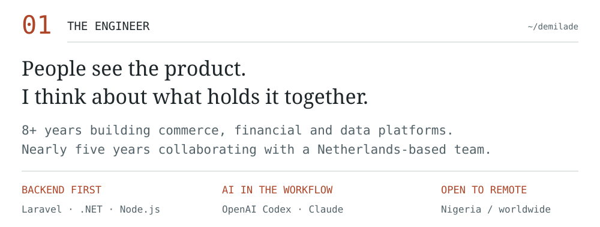
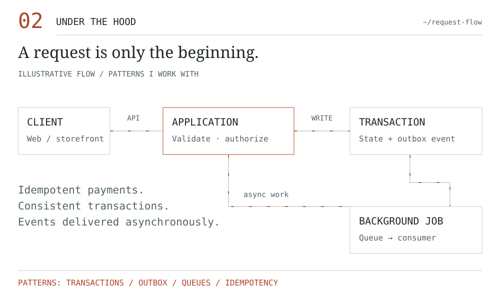
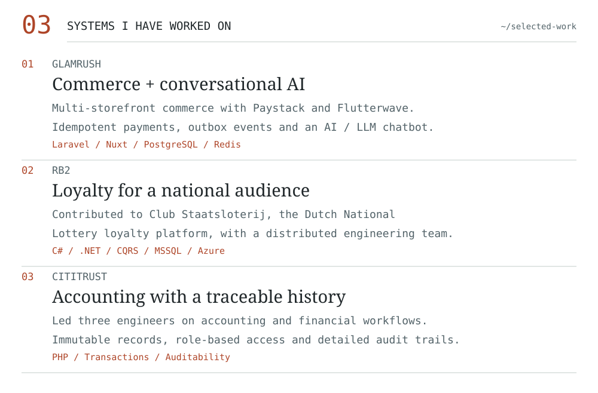
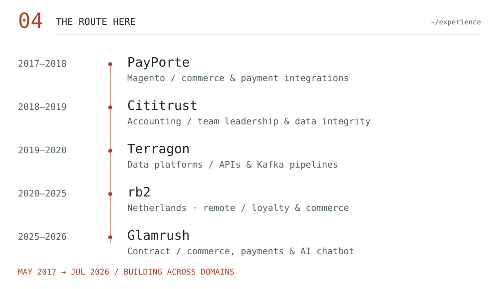
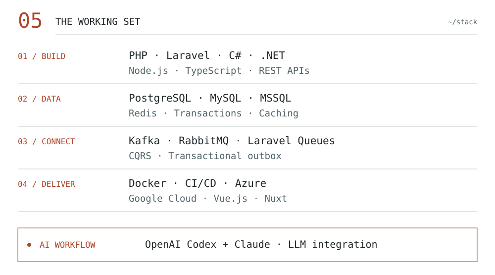
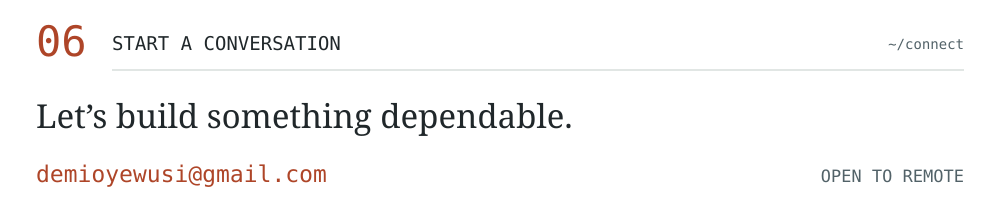

<code>D/O — ENGINEERING INDEX</code>
<h1>Demilade Oyewusi</h1>
<strong>Senior Backend Engineer</strong> · Nigeria / Remote

Reliable systems. Thoughtful architecture.

<a href="https://www.linkedin.com/in/demilade-oyewusi/">LINKEDIN ↗</a> &nbsp; / &nbsp; <a href="mailto:demioyewusi@gmail.com">EMAIL ↗</a> &nbsp; / &nbsp; <a href="https://github.com/taydeez?tab=repositories">REPOSITORIES ↗</a>

<picture><source media="(prefers-color-scheme: dark)" srcset="assets/dark/about.svg" /></picture>

<picture><source media="(prefers-color-scheme: dark)" srcset="assets/dark/flow.svg" /></picture>

<picture><source media="(prefers-color-scheme: dark)" srcset="assets/dark/work.svg" /></picture>

<strong>On GitHub:</strong> <a href="https://github.com/taydeez/SELL_SPREE_BE">Sell Spree ↗</a> — a backend service for a digital marketplace.

<picture><source media="(prefers-color-scheme: dark)" srcset="assets/dark/route.svg" /></picture>

<picture><source media="(prefers-color-scheme: dark)" srcset="assets/dark/stack.svg" /></picture>

<strong>Read the profile as text</strong>

I'm Demilade Oyewusi, a Senior Backend Engineer with 8+ years of experience building production systems across commerce, financial operations, loyalty and data platforms.

- **Glamrush (Dec 2025–Jul 2026):** Multi-storefront e-commerce, Paystack and Flutterwave payments, idempotent workflows, transactional outbox events, and an AI/LLM customer service chatbot.
- **rb2 (Jul 2020–May 2025):** Contributed to Club Staatsloterij, the Dutch National Lottery loyalty platform, using C#/.NET, CQRS, MSSQL and Azure.
- **Terragon (May 2019–May 2020):** Backend services and Kafka pipelines for data ingestion, synchronization and processing.
- **Cititrust (Nov 2018–Apr 2019):** Led three engineers building accounting workflows with immutable records, access controls and audit trails.
- **PayPorte (May 2017–Nov 2018):** Magento commerce, payments, checkout, shipping and installment payment functionality.

**Tools:** PHP, Laravel, C#, .NET, Node.js, TypeScript, PostgreSQL, MySQL, MSSQL, Redis, Kafka, RabbitMQ, Laravel Queues, Docker, CI/CD, Azure, Google Cloud, Vue.js and Nuxt.

**AI:** OpenAI Codex and Claude in my daily development workflow, plus AI/LLM integration for customer service.

**Concept diagram:** A client request is validated and authorized by an application; a transaction persists state and an outbox event; queued work runs asynchronously. The diagram illustrates familiar patterns rather than a specific production deployment.

Based in Nigeria and open to remote opportunities worldwide.

<a href="mailto:demioyewusi@gmail.com"><picture><source media="(prefers-color-scheme: dark)" srcset="assets/dark/contact.svg" /></picture></a>
